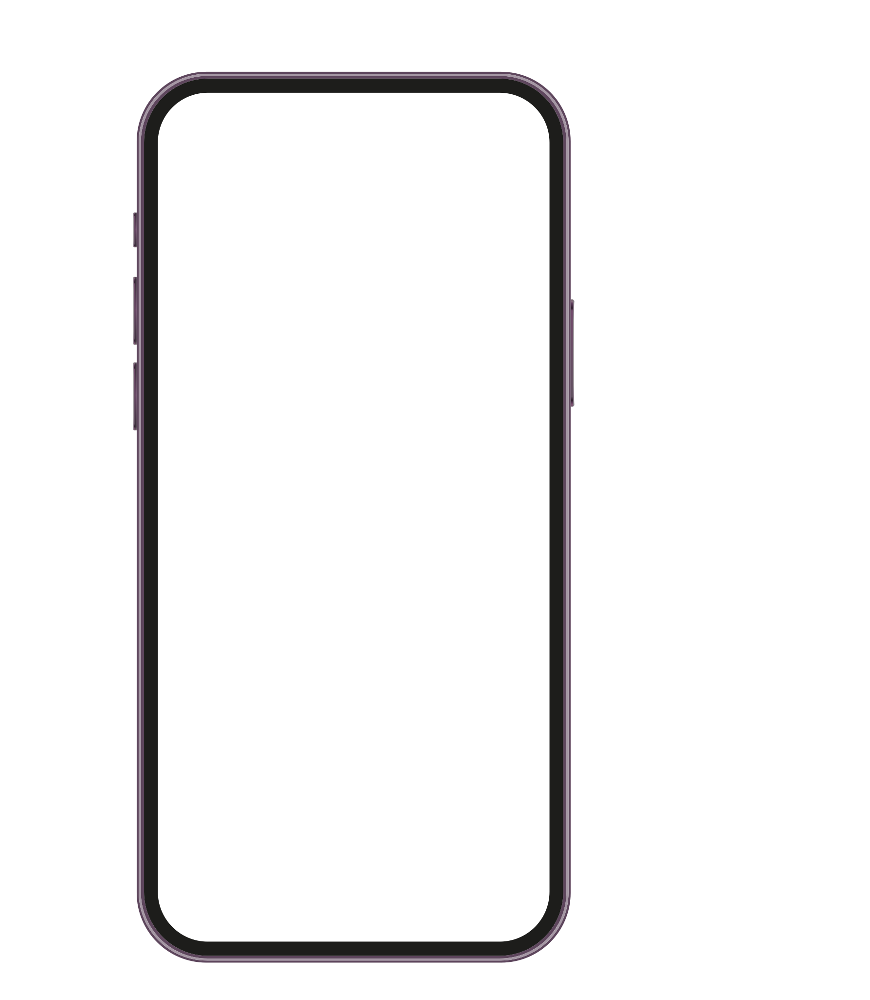

# showcase poster description

The A4 poster dynamically displays a community's name and events within a smartphone mockup, complemented by a QR code and informational text in a clean, high-contrast layout using primarily the Catamaran font family.

This poster is generated as a PDF document by a Next.js 13 API route utilizing the @react-pdf/renderer library and Google Fonts.

## Layout and Design Description

### Overall Layout and Structure

1.  **Format:** The poster is designed for A4 portrait orientation.
2.  **Main Sections:** The layout is predominantly divided into two conceptual columns, though not strictly defined by lines:
    * **Left Side:** Occupies roughly the left two-thirds. Contains the main headline, the large dynamic community name, and a smartphone mockup displaying events.
    * **Right Side:** Occupies roughly the right third. Contains a partner logo area at the top, a QR code with instructions, and an informational text block below the QR code.
3.  **Visual Flow:** The eye is drawn first to the large community name, then likely to the smartphone mockup, followed by the headline and the explanatory text on the right.
4.  **Alignment:** Most text elements are left-aligned (headline, community name, smartphone content). The text elements on the right side (QR code explanation, informational text) appear to be primarily left-aligned within their section, though the QR code itself is centered relative to its accompanying text. The partner logo area is top-right aligned.

### Detailed Section Breakdown

1.  **Top Right Corner:** A small section containing partnership information ("in Kooperation mit dem") and a logo ("kultur land bc:ro").
2.  **Upper Left:** A standard-sized headline *"Was ist los in"*.
3.  **Central Left (Dominant):** The dynamic **Community Name**. This is the largest text element on the poster, rendered in a heavy, bold font. It is left-aligned and positioned below the headline.
4.  **Lower Left:** A visual mockup of a black smartphone.
    * **Smartphone Canvas:** Inside the phone frame:
        * A header bar displaying a website URL ("www.Schafe-vorm-Fenster.de") and a small logo (sheep in a window).
        * The main area is a dynamic list of **Events**. Each event entry typically shows:
            * Date (Day number, abbreviated weekday/month).
            * Time.
            * Event Title (**bolded**).
            * Location (often preceded by a map pin icon).
        * The list appears vertically scrollable within the phone context.
5.  **Mid Right:** A dynamic **QR Code** is displayed prominently. Adjacent to it (usually to the right) is short instructional text explaining how to scan it.
6.  **Lower Right:** An informational block of text containing:
    * Headings/prompts (*"Deine Termine fehlen?"*, *"Mach' das Dorfleben sichtbar."*, *"So einfach geht es:"*, *"Mehr Infos:"*).
    * Explanatory paragraphs and instructions on how to contribute events.
    * Contact details (website, phone number, email address).

### Design Elements

1.  **Colors:**
    * The primary color scheme is monochrome: black text on a white background.
    * The smartphone mockup frame is black.
    * Subtle color exists within the small logo inside the smartphone header (hints of yellow, green, blue).
2.  **Fonts:** A clean, sans-serif font family is used throughout. Hierarchy is created using different font sizes and weights:
    * Very large, bold weight for the community name.
    * Medium-large size for the main headline.
    * Smaller sizes for body text, event details, and contact information.
    * Bold weight is used for emphasis on event titles within the phone list.
3.  **Spacing:**
    * Generous white space is used around the main elements, especially the large community name, creating a clean, uncluttered feel.
    * Vertical spacing between the community name and the smartphone mockup appears consistent but accommodates the potential two-line community name.
    * Spacing within the informational text block on the right is relatively standard paragraph spacing.
    * Spacing within the event list on the smartphone is tighter to maximize information density.
4.  **Borders and Separators:**
    * No explicit borders around the main content sections or the poster itself.
    * The smartphone mockup acts as a visual container/border for the event list.
    * Within the smartphone event list, thin, light-grey horizontal lines appear to separate different dates or possibly individual events, enhancing readability.

### Handling of Dynamic Parts

1.  **Community Name:** The layout adapts to the length of the name. Short names (*"Güst"*) appear on one line with larger font size. Longer names (*"Torgelow-Holländerei"*) wrap onto a second line with a smaller font size. This wrapping pushes the smartphone mockup slightly lower on the page, but the overall structure remains intact.
2.  **Smartphone Event List:** The content *inside* the smartphone screen is dynamic, displaying events relevant to the specific community featured on the poster. The list format (date, time, title, location) remains consistent.
3.  **QR Code:** This is dynamic and unique for each community, presumably linking to their specific online calendar or information source referenced by the poster.

## Resources

### Layout / Design Files

Variant with a short community name:

Variant with a long community name:

### Fonts

**Body/General Fonts:**

* Catamaran Light
* Catamaran Regular
* Catamaran Medium
* Catamaran Semibold

**Logo Font:**

* Courier New

*(Note: These fonts are intended to be sourced via Google Fonts)*

### Image Elements and Logos

Smartphone canvas SVG:

"Schafe vorm Fenster" logo PNG:

"kulturlandbüro" logo SVG:

## Tech Stack

* **PDF Rendering:** Uses the `@react-pdf/renderer` library.
* **Framework Integration:** Implemented as an API route within a Next.js 13 application.
* **API Route Path:** `/api/print/showcase/poster`
* **Font Source:** Utilizes Google Fonts for the Catamaran font family.
* **Package manager:** Uses `yarn` for package management.